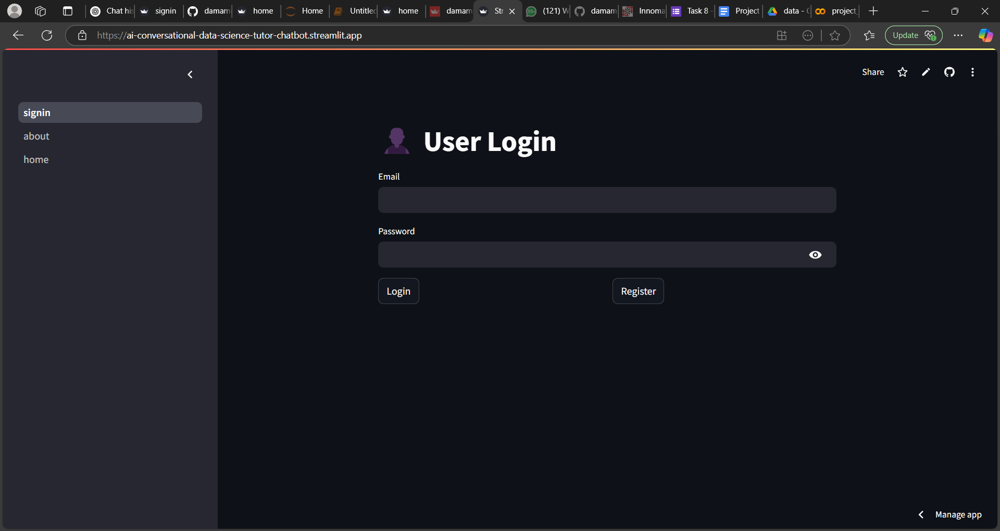
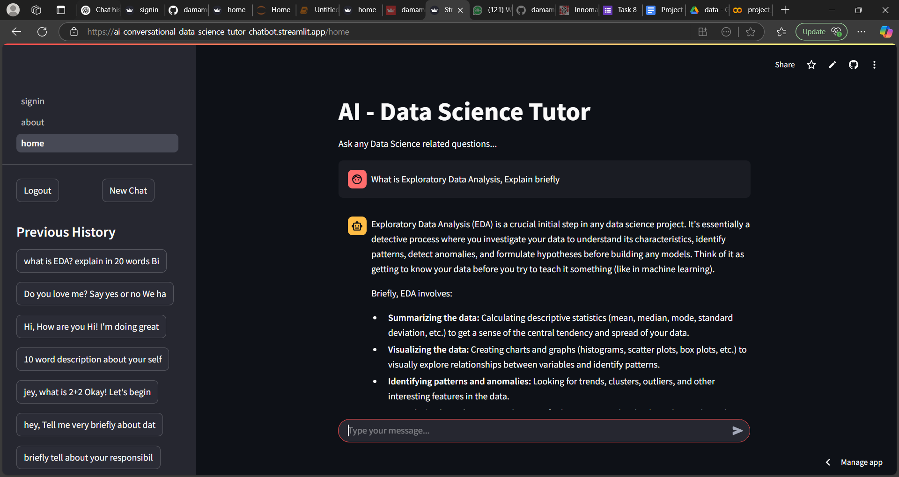
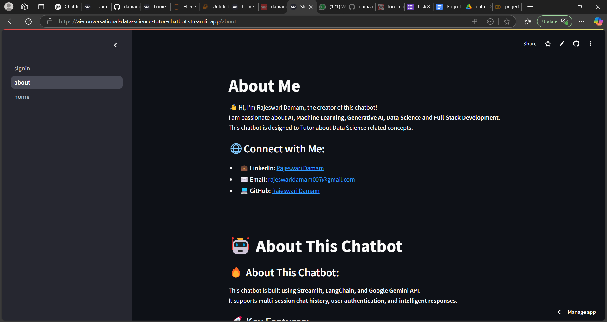

# AI Conversational Data Science Tutor Chatbot

## Live Application

🔗 [AI Conversational Tutor Chatbot](https://ai-conversational-data-science-tutor-chatbot.streamlit.app)


[](https://ai-conversational-data-science-tutor-chatbot.streamlit.app)
[](https://ai-conversational-data-science-tutor-chatbot.streamlit.app)
[](https://ai-conversational-data-science-tutor-chatbot.streamlit.app)

## Overview

The **AI Conversational Tutor Chatbot** is an AI-powered application designed to help users learn and explore data science concepts interactively. It leverages **Google's Gemini API** to provide insightful, real-time responses to user queries.

## Features

- 🧠 **AI-Powered Chatbot**: Engages in interactive conversations to answer data science queries.
- 🔐 **User Authentication**: Secure login system to maintain personalized interactions.
- 🔄 **Session Management**: Keeps track of user conversations for better continuity.
- 🎨 **User-Friendly Interface**: Built using Streamlit for a seamless experience.
- 📊 **Supports Multiple Topics**: Covers various aspects of data science, including machine learning, statistics, and programming.

## Tech Stack

- **Frontend**: Streamlit
- **Backend**: Python
- **AI Model**: Google Gemini API
- **Database**: SQLite (for authentication and session management)
- **Environment Management**: `.streamlit/secrets.toml`

## Project Structure

AI-Conversational-Tutor-Chatbot/
│── .streamlit/              # Streamlit configuration
│   ├── secrets.toml         # Secure API keys (ignored from version control)
│── pages/                   # Additional Streamlit pages
│   ├── about.py             # About page
│   ├── home.py              # Home page
│── db_utils.py              # Database management functions
│── requirements.txt         # Python dependencies
│── signin.py                # User authentication logic
│── README.md                # Project documentation
│── .gitignore               # Files ignored from version control


## Installation & Setup

### 1️⃣ Clone the Repository

```bash
git clone https://github.com/damamrajeswari/AI-Conversational-tutor-chatbot.git
cd AI-Conversational-tutor-chatbot
```


### 3️⃣ Install Dependencies

```bash
pip install -r requirements.txt
```


### 5️⃣ Run the Application

```bash
streamlit run main.py
```

## Usage

1. **Sign In/Register**: Create an account to access personalized learning.
2. **Start Chatting**: Ask data science-related questions.
3. **Continue Learning**: The chatbot maintains context for ongoing discussions.
4. **Log Out**: Securely end your session when done.


## Contributing

1. Fork the repository.
2. Create a new branch (`feature-branch`).
3. Commit your changes.
4. Push to the branch.
5. Open a Pull Request.


---

📩 **Contact**: [rajeswaridamam007@gmail.com](mailto\:rajeswaridamam007@gmail.com)
